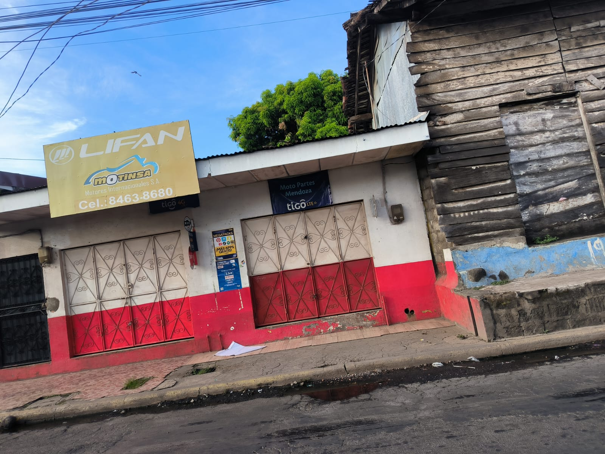

# web-001-shir

<html lang="en">
<head>
    <meta charset="UTF-8">
    <meta name="viewport" content="width=device-width, initial-scale=1.0">
    <title>Mendoza</title>
    
</head>
<body>
    <header>
        <h1>Bienvenidos a Motopartes Mendoza</h1>
    </header>
    <nav>
        <a href="https://www.facebook.com/profile.php?id=100063760641664">Pagina de facebook</a>
        <a href="file:///D:/cascos.html">Cascos</a>
        <a href="file:///D:/guantesmoto.html">Guantes</a>
        <a href="file:///D:/llantas.html">Llantas</a>
        <a href="file:///D:/accesorios.html">Accesorios</a>
    </nav>
    

        <h2>Acerca del negocio</h2>
        
Esta es la pagina web del negocio Moto partes Mendoza donde tenemos varios repuestos de moto en venta.

        <!-- Add your image here -->
        
 

<html lang="es">
<head>
    <meta charset="UTF-8">
    <meta name="viewport" content="width=device-width, initial-scale=1.0">
    <title>Enlace a WhatsApp</title>
    
</head>
<body>
    <a href="https://wa.me/77356948" class="whatsapp-link" target="_blank">Contactar en WhatsApp</a>
</body>
</html>
    

    <footer>
        
&copy; 2024 Mendoza

    </footer>
</body>
</html>

<html lang="es">
<head>
    <meta charset="UTF-8">
    <meta name="viewport" content="width=device-width, initial-scale=1.0">
    <title>Imagen de Fondo</title>
    
</head>
<body>
    <h1>¡Hola Mundo!</h1>
    

</body>
</html>
